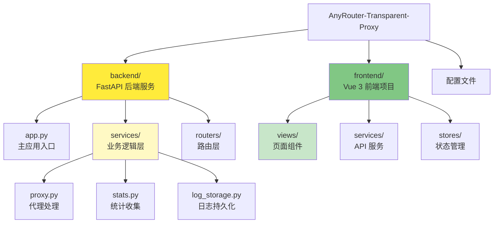
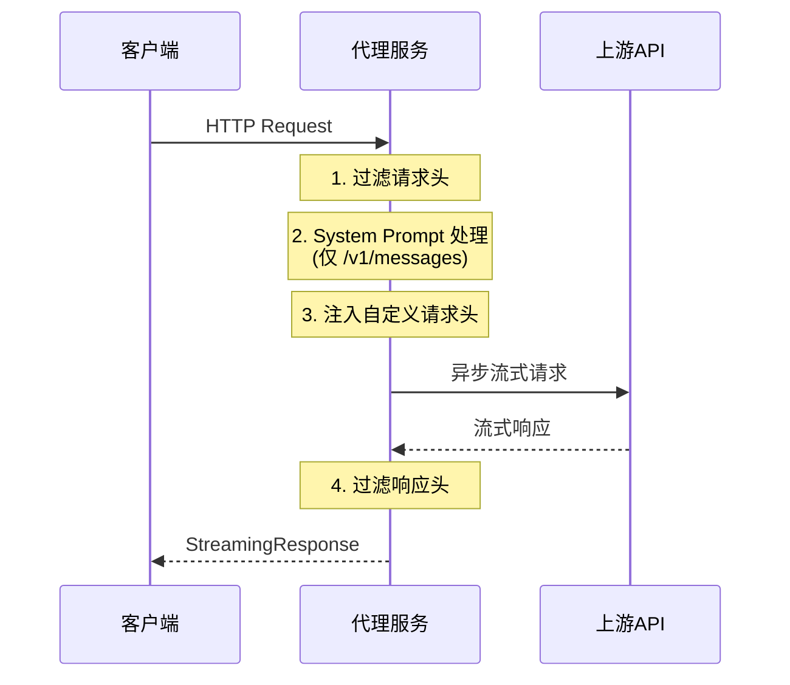

# AnyRouter 透明代理 - AI 上下文索引

> 📅 **最后更新**: 2025-12-18 01:39:08
> 🤖 **维护者**: Claude Code AI Context System
> 📝 **文档版本**: v2.0.0 (精简版)

---

## 🎯 项目概述

**AnyRouter Transparent Proxy** 是一个基于 FastAPI 的轻量级透明 HTTP 代理服务，专为解决 AnyRouter 的 Anthropic API 在 Claude Code 中的兼容性问题而设计。

**核心功能**：
- 完全透明的 HTTP 代理（所有方法、流式响应）
- System Prompt 动态替换/插入
- 自定义请求头注入
- Web 管理面板（实时监控、日志查看、配置管理）
- PWA 支持（离线访问、桌面安装）

---

## 📊 项目架构

### 模块结构



### 请求处理流程



---

## 🗂 模块索引

| 模块 | 路径 | 职责 | 文档 |
|------|------|------|------|
| **后端服务** | [backend/](backend/) | FastAPI 后端，HTTP 代理、统计收集、管理面板 API | [📄 backend/CLAUDE.md](./backend/CLAUDE.md) |
| **前端项目** | [frontend/](frontend/) | Vue 3 前端，Web 管理面板界面 | [📄 frontend/CLAUDE.md](./frontend/CLAUDE.md) |
| **配置文件** | `.env.example`, `env/` | 环境变量和自定义请求头配置 | - |

---

## 🛠 技术栈

### 后端
| 技术 | 版本 | 用途 |
|------|------|------|
| FastAPI | 0.115.5 | 异步 Web 框架 |
| httpx | 0.28.1 | 异步 HTTP 客户端 |
| Uvicorn | 0.32.1 | ASGI 服务器 |

### 前端
| 技术 | 版本 | 用途 |
|------|------|------|
| Vue 3 | 3.5.25 | JavaScript 框架 |
| TypeScript | 5.9.3 | 类型安全 |
| TailwindCSS | 4.0.0 | CSS 框架 |
| Pinia | 3.0.4 | 状态管理 |

---

## 🚀 快速开始

### 本地开发

```bash
# 1. 安装依赖
pip install -r backend/requirements.txt

# 2. 配置环境变量
cp .env.example .env

# 3. 启动服务
python backend/app.py
```

### Docker 部署

```bash
docker-compose up -d
```

### 配置 Claude Code

API 端点：`http://localhost:8088`
管理面板：`http://localhost:8088/admin/`

---

## 🔍 核心技术细节

### System Prompt 处理

**路由限制**：仅在 `/v1/messages` 路由执行

**替换模式**（默认）：
```python
data["system"][0]["text"] = SYSTEM_PROMPT_REPLACEMENT
```

**插入模式**（`SYSTEM_PROMPT_BLOCK_INSERT_IF_NOT_EXIST=true`）：
```python
if "Claude Code" in original_text:
    data["system"][0]["text"] = SYSTEM_PROMPT_REPLACEMENT
else:
    data["system"].insert(0, new_element)
```

### HTTP 头部过滤

**移除的头部**：Connection, Keep-Alive, Transfer-Encoding, Content-Length, Content-Encoding

**自动添加**：Host（重写为目标域名）, X-Forwarded-For

### 流式响应管理

**关键设计**：
- 使用 `httpx.build_request()` + `send(stream=True)` 发送请求
- 使用 `BackgroundTask(resp.aclose)` 自动管理连接关闭
- 避免过早关闭连接导致的 `RuntimeError`

---

## 📂 关键文件

| 文件 | 职责 |
|------|------|
| [backend/app.py](backend/app.py) | 主应用入口，FastAPI 应用定义 |
| [backend/config.py](backend/config.py) | 配置管理，环境变量加载 |
| [backend/services/proxy.py](backend/services/proxy.py) | 代理处理逻辑 |
| [backend/services/stats.py](backend/services/stats.py) | 统计收集服务 |
| [backend/routers/admin.py](backend/routers/admin.py) | 管理面板 API |
| [frontend/src/main.ts](frontend/src/main.ts) | 前端应用入口 |
| [frontend/src/services/api.ts](frontend/src/services/api.ts) | API 服务层 |

---

## ⚙️ 环境变量

| 变量 | 默认值 | 说明 |
|------|--------|------|
| `API_BASE_URL` | `https://anyrouter.top` | 上游 API 地址 |
| `SYSTEM_PROMPT_REPLACEMENT` | `None` | System Prompt 替换文本 |
| `SYSTEM_PROMPT_BLOCK_INSERT_IF_NOT_EXIST` | `false` | 启用插入模式 |
| `PORT` | `8088` | 服务端口 |
| `DEBUG_MODE` | `false` | 调试模式 |
| `ENABLE_DASHBOARD` | `true` | 启用管理面板 |
| `LOG_PERSISTENCE_ENABLED` | `true` | 启用日志持久化 |

---

## 📚 相关资源

- [FastAPI 文档](https://fastapi.tiangolo.com/)
- [Vue 3 文档](https://vuejs.org/)
- [httpx 文档](https://www.python-httpx.org/)
- [Anthropic API 文档](https://docs.anthropic.com/)

---

**© 2024 AnyRouter Transparent Proxy | MIT License**
