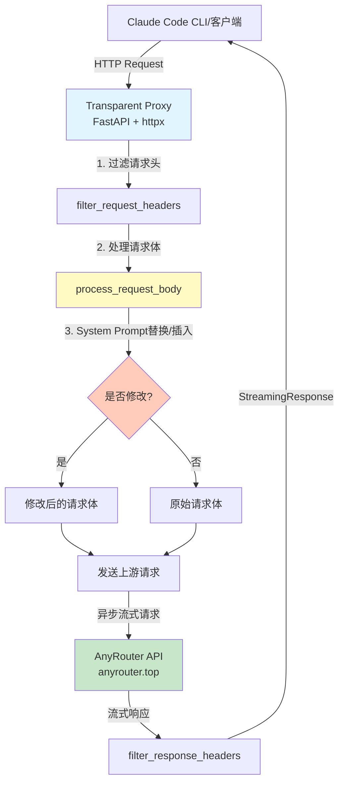
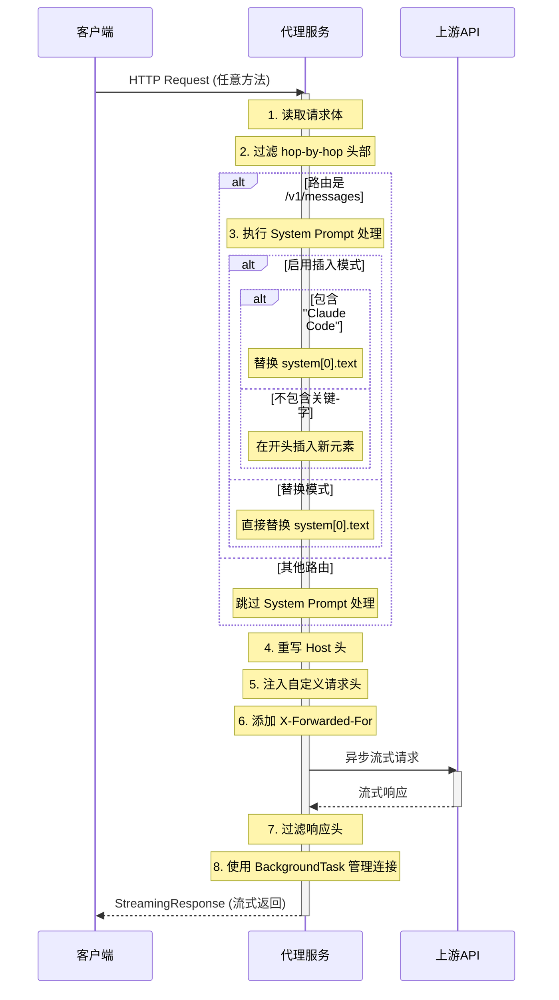
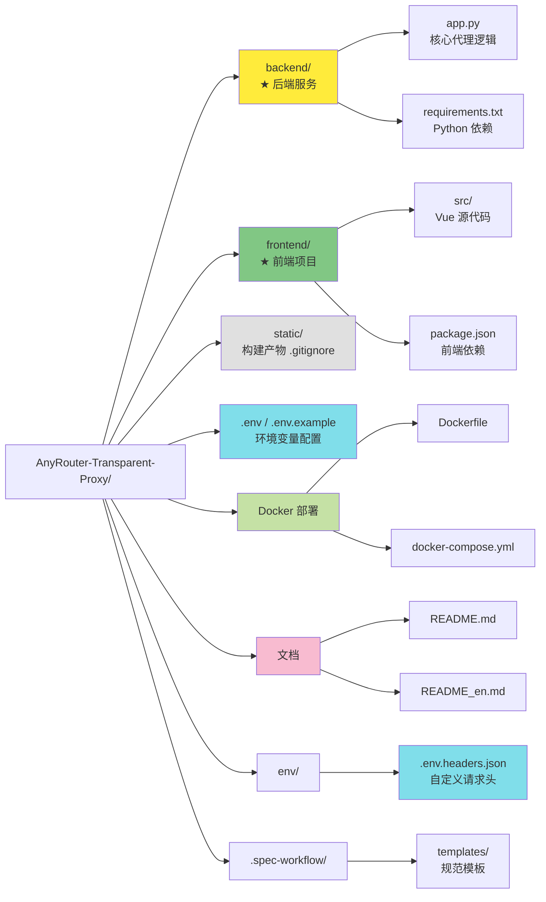

# AnyRouter 透明代理 - AI 上下文索引

> 📅 **初始化时间**: 2025-12-08 22:59:51
> 🤖 **维护者**: Claude Code AI Context System
> 📝 **文档版本**: v1.0.0

---

## 🎯 项目概述

**AnyRouter Transparent Proxy** 是一个基于 FastAPI 的轻量级透明 HTTP 代理服务，专为解决 AnyRouter 的 Anthropic API 在 Claude Code for VS Code 插件中报错 500 的问题而设计。

### 核心价值

- **完全透明**: 支持所有 HTTP 方法，无缝代理请求
- **流式响应**: 基于异步架构，完美支持 SSE 流式传输
- **智能处理**: System Prompt 动态替换/插入，支持自定义请求头注入
- **标准兼容**: 严格遵循 RFC 7230 规范，正确处理 HTTP 头部
- **高性能**: 连接池复用，异步处理，高效应对并发请求

### 项目愿景

提供一个可靠、高性能、易部署的 Anthropic API 透明代理解决方案，使开发者能够无缝集成 Claude AI 服务。

---

## 📊 项目架构

### 系统架构图



### 请求处理流程



### 目录结构图



---

## 🧩 核心组件

### 1. 主应用模块 (`backend/app.py`)

**职责**: 核心代理逻辑、请求/响应处理、生命周期管理、Web 管理面板 API

**关键函数**:

| 函数名 | 行号 | 功能描述 |
|--------|------|----------|
| `lifespan()` | 207-296 | FastAPI 生命周期管理，初始化/关闭 HTTP 客户端 |
| `load_custom_headers()` | 375-413 | 从 JSON 文件加载自定义请求头配置 |
| `filter_request_headers()` | 432-445 | 过滤请求头，移除 hop-by-hop 头部和 Content-Length |
| `filter_response_headers()` | 448-459 | 过滤响应头，移除 hop-by-hop 头部和 Content-Length |
| `process_request_body()` | 462-551 | 处理请求体，替换/插入 System Prompt |
| `health_check()` | 556-565 | 健康检查端点，用于容器监控 |
| `admin_static()` | 571-605 | 处理 Web 管理面板静态文件请求 |
| `get_stats()` | 735-803 | 获取系统统计信息 API |
| `stream_logs()` | 872-966 | 实时日志流 SSE 端点 |
| `proxy()` | 998-1148 | 主代理函数，捕获所有路由并转发请求 |

**设计亮点**:
- ✅ 使用 `lifespan` 事件管理 HTTP 客户端生命周期
- ✅ 全局共享 `httpx.AsyncClient` 实现连接池复用
- ✅ `build_request()` + `send(stream=True)` + `BackgroundTask` 优雅管理流式响应
- ✅ 自动过滤 RFC 7230 规定的 hop-by-hop 头部
- ✅ System Prompt 支持替换模式和插入模式

### 2. 配置管理

**环境变量** (`.env` / `.env.example`):

| 变量名 | 默认值 | 说明 |
|--------|--------|------|
| `API_BASE_URL` | `https://anyrouter.top` | 上游 API 目标地址 |
| `SYSTEM_PROMPT_REPLACEMENT` | `None` | System Prompt 替换文本 |
| `SYSTEM_PROMPT_BLOCK_INSERT_IF_NOT_EXIST` | `false` | 启用插入模式而非替换模式 |
| `HTTP_PROXY` / `HTTPS_PROXY` | - | 代理配置（可选） |
| `DEBUG_MODE` | `false` | 调试模式开关 |
| `PORT` | `8088` | 服务端口 |

**自定义请求头** (`env/.env.headers.json`):

```json
{
  "User-Agent": "claude-cli/2.0.8 (external, cli)"
}
```

- 支持注入任意自定义请求头
- 以 `__` 开头的字段会被忽略（用于注释）
- 自动覆盖原请求中的同名头部

### 3. Docker 部署

**Dockerfile**:
- 基础镜像: `python:3.12-slim`
- 工作目录: `/app`
- 健康检查: 每 30 秒检查 `/health` 端点
- 环境变量: `PYTHONUNBUFFERED=1`, `PYTHONDONTWRITEBYTECODE=1`

**docker-compose.yml**:
- 服务名: `anthropic-proxy`
- 网络模式: `host` (适用于 Linux)
- 自动重启: `unless-stopped`
- 卷挂载: `./env/` → `/app/env/` (用于自定义请求头配置)

---

## 🛠 技术栈

### 核心依赖

| 库名 | 版本 | 用途 |
|------|------|------|
| **FastAPI** | 0.115.5 | 高性能异步 Web 框架 |
| **Uvicorn** | 0.32.1 | ASGI 服务器 (支持 HTTP/1.1 和 WebSocket) |
| **httpx** | 0.28.1 | 现代异步 HTTP 客户端，支持 HTTP/2 |
| **python-dotenv** | 1.0.1 | 环境变量管理 |

### 技术特性

- **异步架构**: 基于 `asyncio` 和 ASGI 的异步 I/O
- **连接池复用**: 共享 `httpx.AsyncClient` 实例
- **流式传输**: `aiter_bytes()` + `StreamingResponse` 实现零拷贝流式转发
- **生命周期管理**: FastAPI `lifespan` 事件自动管理资源
- **标准兼容**: 符合 RFC 7230 (HTTP/1.1 消息语法和路由)

---

## 📝 开发规范

### 代码风格

- **注释语言**: 中文（与现有代码保持一致）
- **缩进**: 4 空格
- **行宽**: 建议不超过 120 字符
- **命名规范**:
  - 函数: `snake_case`
  - 常量: `UPPER_SNAKE_CASE`
  - 类: `PascalCase`

### 日志规范

**日志前缀约定**:
- `[Proxy]`: 主代理函数日志
- `[System Replacement]`: System Prompt 处理日志
- `[Custom Headers]`: 自定义请求头加载日志
- `[Stream Error]`: 流式响应错误日志

**生产环境建议**:
- 移除敏感信息（API Key、请求体内容）
- 关闭 `DEBUG_MODE`
- 使用结构化日志（JSON 格式）

### 安全最佳实践

- ✅ 防重定向攻击: `follow_redirects=False`
- ✅ 请求超时: 60 秒防止资源耗尽
- ✅ 错误处理: 上游请求失败返回 502
- ✅ 自动容错: Content-Length 自动计算
- ✅ 连接管理: 使用 `BackgroundTask` 确保连接正确关闭

---

## 📂 关键文件索引

### 核心文件

| 文件路径 | 行数 | 职责 | 最后修改 |
|----------|------|------|----------|
| `backend/app.py` | 1156 | 核心代理逻辑、请求/响应处理、Web 管理面板 API | 最近 |
| `backend/requirements.txt` | 4 | Python 依赖清单 | 稳定 |
| `frontend/` | - | Vue 3 前端项目（Web 管理面板） | 最近 |
| `.env.example` | 19 | 环境变量配置模板 | 稳定 |
| `env/.env.headers.json` | 5 | 自定义请求头配置示例 | 稳定 |

### 部署文件

| 文件路径 | 行数 | 职责 |
|----------|------|------|
| `Dockerfile` | 38 | Docker 镜像构建配置 |
| `docker-compose.yml` | 29 | Docker Compose 编排配置 |

### 文档文件

| 文件路径 | 语言 | 内容 |
|----------|------|------|
| `README.md` | 中文 | 项目说明、快速开始、配置指南 |
| `README_en.md` | 英文 | 英文版项目文档 |
| `CLAUDE.md` | 中文 | AI 上下文索引（本文档） |

---

## 🔍 关键技术细节

### System Prompt 处理逻辑

**路由限制** (`backend/app.py:1030-1031`):
- 仅在路由为 `/v1/messages` 时执行 System Prompt 处理
- 其他路由（如 `/v1/completions`, `/v1/models`）跳过处理

**替换模式** (默认):
```python
# 直接替换 system[0].text
data["system"][0]["text"] = SYSTEM_PROMPT_REPLACEMENT
```

**插入模式** (`SYSTEM_PROMPT_BLOCK_INSERT_IF_NOT_EXIST=true`):
```python
if "Claude Code" in original_text:
    # 包含关键字 → 替换
    data["system"][0]["text"] = SYSTEM_PROMPT_REPLACEMENT
else:
    # 不包含关键字 → 在开头插入新元素
    new_element = {
        "type": "text",
        "text": SYSTEM_PROMPT_REPLACEMENT,
        "cache_control": {"type": "ephemeral"}
    }
    data["system"].insert(0, new_element)
```

### HTTP 头部过滤规则

**移除的 hop-by-hop 头部** (`backend/app.py:418-427`):
- Connection
- Keep-Alive
- Proxy-Authenticate
- Proxy-Authorization
- TE
- Trailers
- Transfer-Encoding
- Upgrade
- Content-Length (由 httpx 自动重新计算)

**自动添加的头部**:
- `Host`: 自动改写为目标服务器域名
- `X-Forwarded-For`: 追踪客户端 IP 链

### 流式响应生命周期管理

**关键代码** (`backend/app.py:1057-1136`):

```python
# 1. 构建请求（不使用 context manager）
req = http_client.build_request(
    method=request.method,
    url=target_url,
    headers=forward_headers,
    content=body,
)

# 2. 发送请求并开启流式模式（不使用 async with）
resp = await http_client.send(req, stream=True)

# 3. 异步生成器：流式读取响应内容
async def iter_response():
    try:
        async for chunk in resp.aiter_bytes():
            yield chunk
    except Exception as e:
        # 优雅处理客户端断开连接
        pass
    finally:
        # 资源释放由 BackgroundTask 处理
        pass

# 4. 使用 BackgroundTask 在响应完成后自动关闭连接
return StreamingResponse(
    iter_response(),
    status_code=resp.status_code,
    headers=response_headers,
    background=BackgroundTask(resp.aclose),  # 关键：自动关闭
)
```

**设计优势**:
- ✅ 避免过早关闭连接导致的 `RuntimeError`
- ✅ 自动管理连接生命周期，防止资源泄漏
- ✅ 支持长时间流式响应（60 秒超时）

---

## 🚀 快速开始

### 本地开发

```bash
# 1. 安装后端依赖
pip install -r backend/requirements.txt

# 2. 复制环境变量模板
cp .env.example .env

# 3. （可选）构建前端（如需使用 Web 管理面板）
cd frontend
npm install
npm run build
cd ..

# 4. 启动服务（开发模式，从项目根目录运行）
python backend/app.py
```

### Docker 部署

```bash
# 1. 启动服务
docker-compose up -d

# 2. 查看日志
docker-compose logs -f

# 3. 重启服务
docker-compose down && docker-compose up -d
```

### 配置 Claude Code

在 VS Code 中配置 Claude Code 插件，将 API 端点指向:

```
http://localhost:8088
```

---

## 📈 扩展建议

### 短期改进

- [ ] 添加请求/响应日志持久化（可选 JSON Lines 格式）
- [ ] 实现请求限流（基于 IP 或 API Key）
- [ ] 添加 Prometheus metrics 端点
- [ ] 支持多上游负载均衡

### 长期规划

- [ ] 支持 WebSocket 代理
- [ ] 实现请求缓存机制（Redis）
- [ ] 添加 API Key 验证和配额管理
- [ ] 构建 Web 管理面板

---

## 📚 相关资源

- [FastAPI 官方文档](https://fastapi.tiangolo.com/)
- [httpx 官方文档](https://www.python-httpx.org/)
- [RFC 7230 - HTTP/1.1 消息语法和路由](https://tools.ietf.org/html/rfc7230)
- [Anthropic API 文档](https://docs.anthropic.com/)

---

## 📝 维护日志

| 日期 | 版本 | 变更说明 |
|------|------|----------|
| 2025-12-08 | v1.0.0 | 初始化 AI 上下文索引，生成架构图和文档 |

---

**注意**: 本文档由 Claude Code AI Context System 自动生成和维护，旨在为 AI 助手提供项目上下文信息。请在重大架构变更时更新本文档。

---

**© 2024 AnyRouter Transparent Proxy | MIT License**
